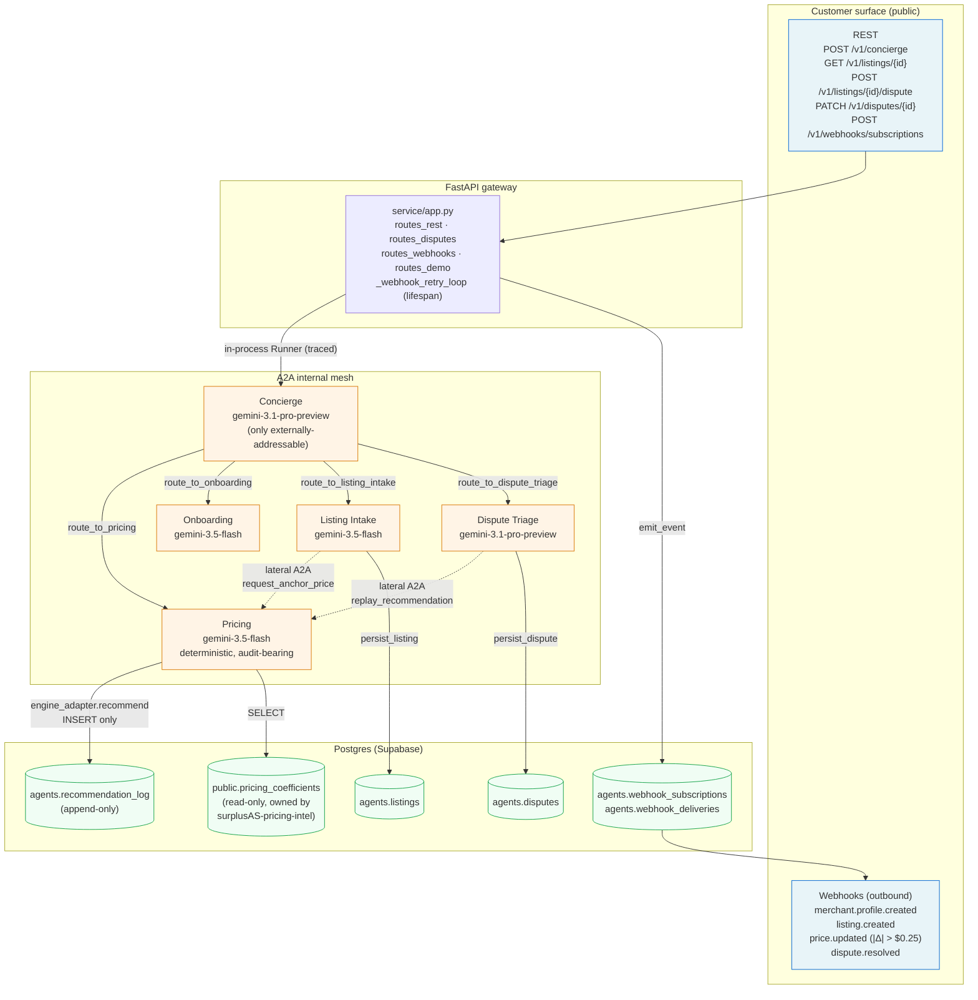
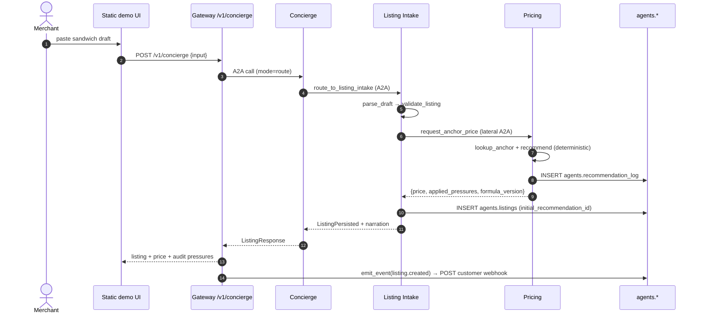
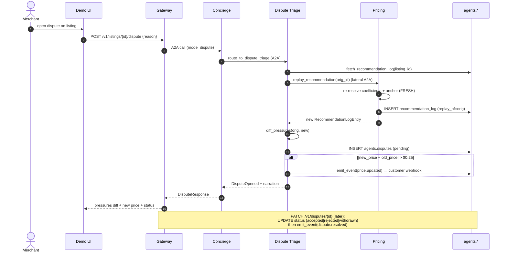

# Architecture — `surplusAS-agents-2.0`

A hub-and-spoke multi-agent service: one FastAPI gateway on Fly.io with all five ADK agents running **in-process**. The **Concierge** is the only agent on the customer REST path; four specialists coordinate with it across the internal mesh. Customers see REST + webhooks.

Two A2A layers, by design (see [Customer integration model](#customer-integration-model)):
- **Open A2A surface** — every agent can also be published over the **open Agent-to-Agent protocol** (Agent Card at `/.well-known/agent-card.json` + JSON-RPC 2.0) via ADK's `to_a2a()` adapter, so external enterprise agents can discover and call it.
- **Internal mesh transport** — inter-agent calls run as in-process ADK `Runner` streams (`shared/a2a.py`): no network hop, spans parent naturally.

## Agent topology

The two dotted edges (`Listing Intake → Pricing`, `Dispute Triage → Pricing`) are the only lateral A2A links by design. Everything else flows through the Concierge.

## Beat 1 — paste draft, get priced listing

## Beat 2 — dispute, replay, narrate, webhook

## Hard guardrails (data plane)

1. **Pricing is deterministic.** The LLM never invents a number. The only path is [`pricing_engine.formula.recommend`](../vendor/surplusas-pricing/pricing_engine/formula.py) via [`agents/pricing/engine_adapter.py`](../agents/pricing/engine_adapter.py).
2. **Every recommendation is auditable.** `applied_pressures` + `formula_version` round-trip from engine → REST/webhook → DB → Concierge narration.
3. **`agents.recommendation_log` is append-only.** Replays write NEW rows with `replay_of=<orig_id>` ([`engine_adapter.replay_recommendation`](../agents/pricing/engine_adapter.py)).
4. **`public.pricing_coefficients` is read-only.** Owned by `surplusAS-pricing-intel`; this repo only `SELECT`s.
5. **No fine-tuning.** Base Gemini + prompting + tools.
6. **Per-merchant coefficient differentiation is OFF.** Lookup keyed on `(category, region)` only.

## Customer integration model

- **Customer-facing:** REST for synchronous ops, HMAC-SHA256 signed webhooks for async events (over the repo-wide `WEBHOOK_SIGNING_KEY`, NOT the per-subscription secret — that's reserved for future inbound verification).
- **A2A — open surface:** every agent can be published over the open A2A protocol via ADK's `to_a2a()` adapter ([`service/a2a_app.py`](../service/a2a_app.py)) — a discoverable Agent Card at `/.well-known/agent-card.json` + a JSON-RPC 2.0 endpoint, framework-agnostic. Verify with `uv run python -m scripts.verify_a2a` (stock `a2a-sdk` client; no cloud creds).
- **A2A — internal mesh transport:** the hub-and-spoke inter-agent calls go through [`shared/a2a.py`](../shared/a2a.py) as in-process ADK `Runner` streams; one cached Runner per agent, per-call session ids.
- **Tracing:** OpenTelemetry spans across every A2A hop, exported over OTLP when `OTEL_EXPORTER_OTLP_ENDPOINT` is set (no-op otherwise); span names pinned in the [implementation plan](~/.claude/plans/the-ending-of-the-shimmering-reef.md) §8.
- **Webhook retry:** sync-first-attempt with async sweep; `2^attempt`-second backoff (2, 4, 8, 16, 32s), dead-letter at attempt=5. Idempotency by `event_id`. See [`CLAUDE.md`](../CLAUDE.md) "Webhook semantics".

## Deployment

One Fly.io machine runs the whole system: the FastAPI gateway (static demo UI, customer REST, webhook retry loop) with all five ADK agents loaded in-process. Postgres is Supabase over a plain asyncpg DSN (`DATABASE_URL`). Secrets (`GOOGLE_API_KEY`, `DATABASE_URL`, `WEBHOOK_SIGNING_KEY`) are Fly secrets, landing as env vars at container start. Deploy with `fly deploy` (see [`fly.toml`](../fly.toml)); provision the database per [`scripts/provision_supabase.sql`](../scripts/provision_supabase.sql).

Sessions are in-memory (`shared/a2a.py`), so the service is pinned to one machine; swap in a DB-backed `SessionService` before scaling out.
